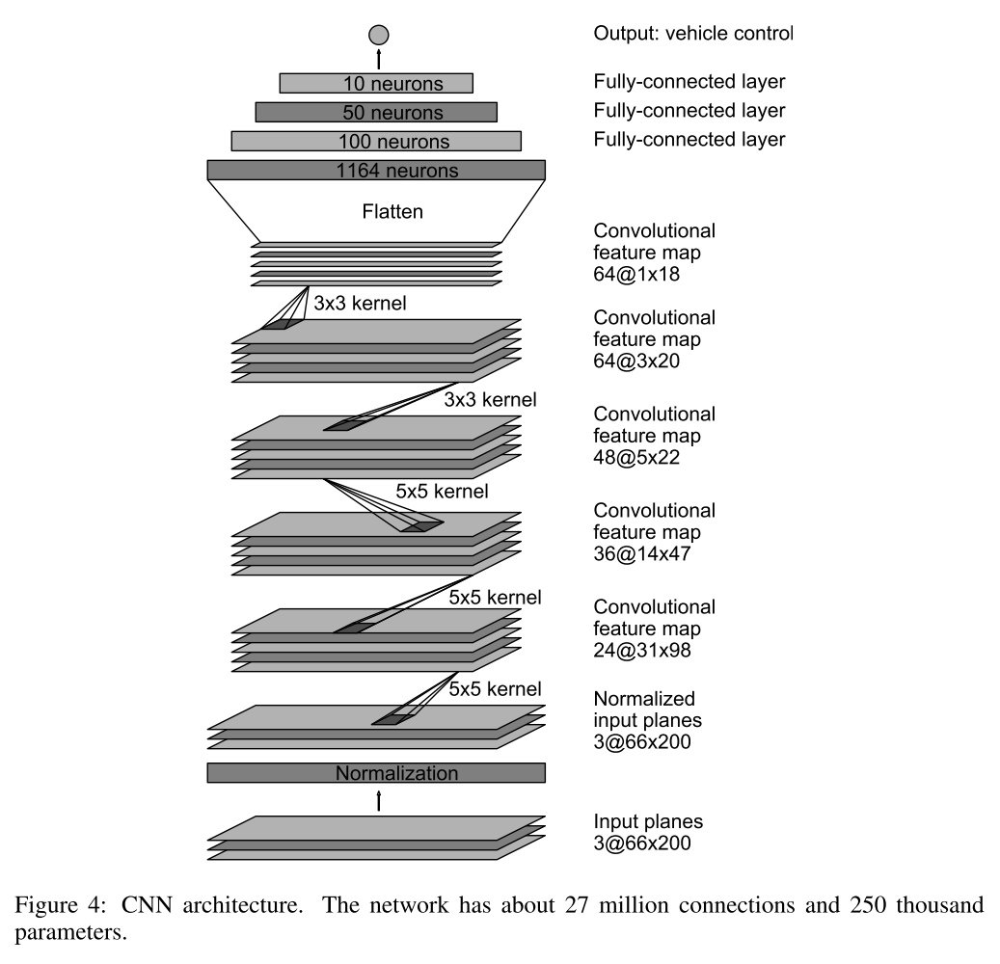

## End to End Learning for Self-Driving Cars

* Still work in progress, but basic model trained on GTA V dataset can be found:

	To Do:

	* Get proper driving data.
	* Inlcude the autonomy score.
	* Include model internal state viz.

# About the Model

* Originally the model consists of:

> *The network consists of 9 layers, including a normalization layer, 5 convolutional layers and 3 fully connected layers. The input image is split into YUV planes and passed to the network.*

* `model.py` contains the ConvNet, running the file will output a model to be used by `train.py`

### Dependecy:

* Keras '1.2.0'
* Theano '0.9.0dev4.dev-RELEASE'

### Dataset:

* The GTA V Dataset was used, previously it use to be hosted [here](deepdrive.io).
* The dataset is messy often, but good enough for training/testing a model. 
* If you have the dataset, `load_deepdrive_data.py` can be used to reduce the data into 128 and do any normalization desired for the model.

* trained model / `weights`, can be downloaded [here](https://drive.google.com/open?id=0B-vUVYNKbYr2bS1COWZHN3Rub2M)

### Training results for steering with Autopilot ConvNet:

* GPU (Trained 1080).

* Green is the original steering, and red is the Model's predictions.

 > *the data contains weird incidents where the car is not going anywhere and suddent appearnce of other cars*